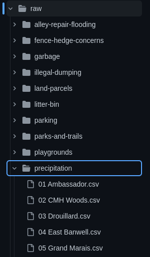
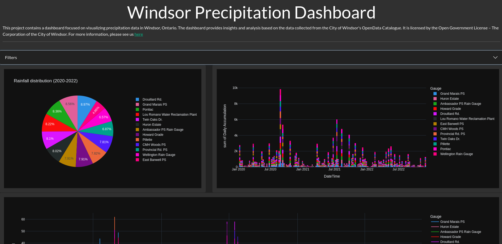

+++
title = "Precipitation Dashboard and Open Data"
date = "2023-07-16"
author = "dev"
cover = ""
tags = ["code", "windsor", "rss", "news", "civics", "precipitation", "opendata"]
showFullContent = false
+++

After [my first attempt at making a RSS feed aggregator](), I began to feel discouraged. The data that I hoped would be there was disorganized and I felt like every workaround would lead me to a new problem. I took some time away from the code, and I came back with a new approach.

This time, instead of trying to make an aggregator, I decided to instead focus my attention to 3 smaller problems.

1. Create an automated process for collecting and updating the [City of Windsor Open Data Catalogue](https://opendata.citywindsor.ca/).

2. Select and clean one category of the collected data.

3. Create and launch a dashboard with graphs for the selected category.

## Data collection

The first step was to scrap the original [RSS feed aggregator](https://github.com/dntiontk/rss-feed-aggregator). It served its purpose as a learning tool, and gave me enough information to know how I wanted to approach data collection this time.

I made a new [RSS feed reader](https://github.com/dntiontk/windsor-opendata/tree/main/rss-feed-reader) with the purpose of pulling the RSS feed, categorizing it (based on what I learned last time), and committing it to git. While much simpler, this version was annoying to write. Its filled with massive `switch-case` statements that check for string matching in the title of each RSS feed item. Its ugly, but it does exactly what I need it to do. The short version is that I unmarshal the data into an `RSS` data type, then I iterate over each item, adding them to their appropriate category. Finally, I iterate over each category and write each item it to a file within the category's directory.



Once this data was collected, I needed a way to automate the updates. Since the dataset are already stored in git, all I needed to do was run the RSS feed reader, and commit the changes. This was made easy enough using Github Actions.

```yaml
# set the job to run everyday at 12 (or on manual trigger)
on:
  schedule:
    - cron: '0 12 * * *'
  workflow_dispatch:

jobs:
  build:
    runs-on: ubuntu-latest
    steps:
    - uses: actions/checkout@v3


    - name: Set up Go
      uses: actions/setup-go@v3
      with:
        go-version: 1.19

    - name: Update data
      run: go run rss-feed-reader/main.go
      
    - name: Commit changes
      uses: EndBug/add-and-commit@v9
      with:
        default_author: github_actions
        add: 'raw/*'
```

The last step of this action commits the changes in the `raw` directory using **github_actions** as the author. Now I have a repository that stores, categorizes and automatically updates itself based on the Windsor Open Data RSS feed.

## Selecting and cleaning a category

There is a good amount of data made available, and eventually I will like to have touched most, if not all, of the datasets. For now, I chose precipitation data, because I was familiar with that data from my first attempt and already had an idea of how I wanted to clean it.

To do the cleaning, for each file in the `raw/precipitation` directory, extract the gauge, convert the file into a dataframe (parsing the strangely formatted dates), drop the unused columns, add a column with the gauge name, and return a list of the collected dataframes.

```python
def collect_dataframes(files):
    dfs = []
    for f in files:
        gauge_name = extract_gauge(f)
        # read in the csv file
        df = pd.read_csv(
            f, skiprows=2, parse_dates=["DateTime"], date_format="%m/%d/%Y %H:%M"
        )
        df = drop_unnamed_columns(df)
        df["Gauge"] = gauge_name
        dfs.append(df)
    return dfs
```

After that, I concatenate the dataframes and write them to a file.

```python
    df_list = collect_dataframes(raw_files)
    # concatenate dataframes
    combined = pd.concat(df_list, ignore_index=True)
    # set the index to 'DateTime'
    combined.set_index("DateTime", inplace=True)
    combined.sort_index(inplace=True)
    # write to file
    combined.to_csv(path.join(args.destination, "windsor-precipitation.csv"))
```

This data is then stored and pushed to git as well. I opted not to automate the data cleaning process for now, but this might be something I tackle in the future.

## Precipitation Dashboard

The final step was to present the data in a useful way. **Unfortunately**, this is stepping quite a bit outside of my comfort zone. **Fortunately**, I am somewhat familiar with using [Plotly Dash](https://dash.plotly.com/) and was able to put together a small dashboard with some filtering functionality.



You can visit the site now at https://precipitation-dashboard-4a12becc0918.herokuapp.com/ and I've made all the code for this dashboard available [here](https://github.com/dntiontk/precipitation-dashboard).

The dashboard pulls the cleaned data, and provides the following graphs:

- Rainfall distribution pie chart
- Sum of daily precipitation accumulation histogram
- Rainfall total over time line chart

There is definitely room to improve this dashboard, so if you have any suggestions, please feel free to submit a pull request or open an issue on [the Github repository](https://github.com/dntiontk/precipitation-dashboard).

---

**Keep coding with purpose!  ::dev**
