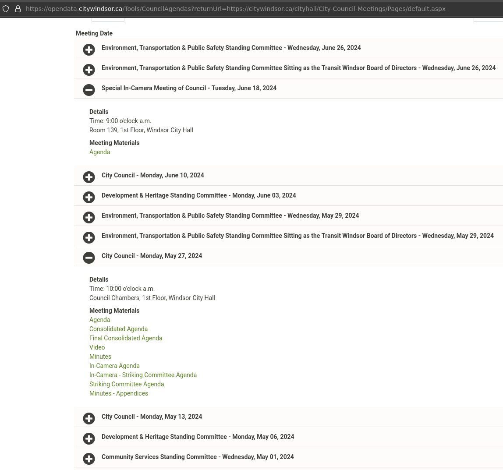
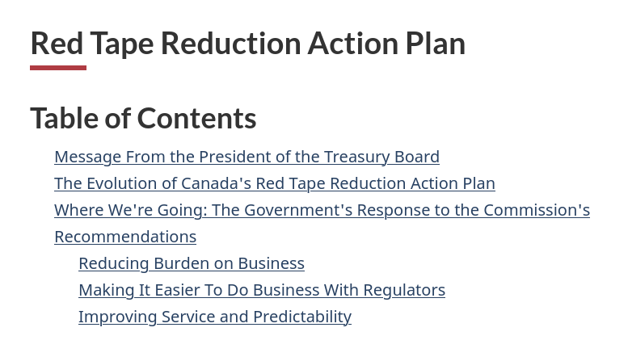
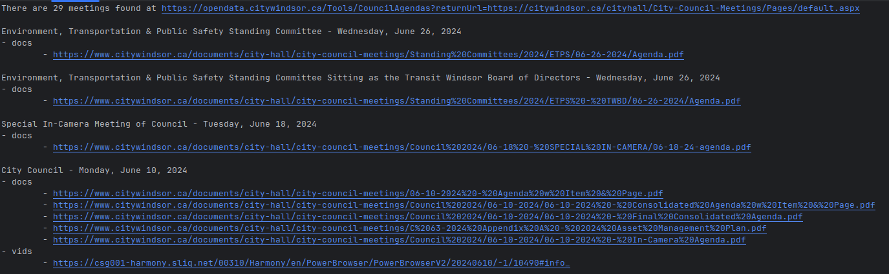

When I started working on the civic-code project, I was annoyed at the lack of accessibility when it came to accessing City Council meeting documents and videos.

> The meeting index is not well organized either. You have to open up a menu just to see what documents (agenda, minutes, video link, appendices, etc.) have been added to a particular meeting.

Considering that this is still an issue, I decided that I would try to create a more structure index of the documents. 

**Why is indexing city council documents important, you may be asking**. 

Accessibility! You should not need to be an experienced politician or a policy wonk to be able to participate in municipal politics. It feels as if bureaucracy is used to discourage or limit political participation. 

Here is a screenshot of the aspx site used to serve the documents:

*https://opendata.citywindsor.ca/Tools/CouncilAgendas?returnUrl=https://citywindsor.ca/cityhall/City-Council-Meetings/Pages/default.aspx*

Some questions that come to mind:

- Why are all City Council and committee meeting documents served using a custom tool?
- Why aren't the documents categorized by meeting or committee?
- Why are all meeting document links served on the same page regardless of type?
- Why force users to check the website to see if new documents are added?

As I said in the [first civics code post]():

> if the goal was to encourage apathy while maintaining plausible deniability, I would consider it a very effective website.

I think that this could be considered **administrative burden**. Our government has recognized this burden when it comes to businesses, but there is much less of an effort in cutting the red tape for citizen participation.

*https://www.canada.ca/en/government/system/laws/developing-improving-federal-regulations/requirements-developing-managing-reviewing-regulations/red-tape-reduction-action-plan.html*

---

In my annoyance, I put together a little web-scraper to get a list of meetings with the corresponding documents. The output is still pretty raw, but this should give me what I need to create an index and the required automation to keep the index up-to-date.

To see the code used for scraping the page, check out https://github.com/dntiontk/windsor-opendata/tree/main/council-meetings.

---

**Keep coding with purpose!  ::dev**